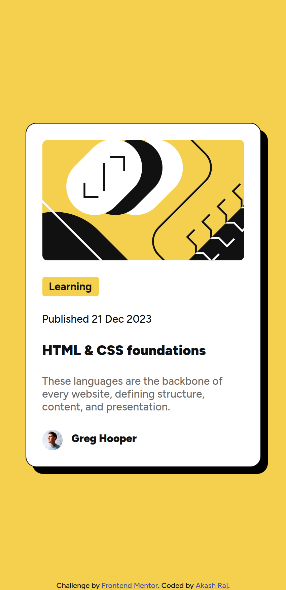
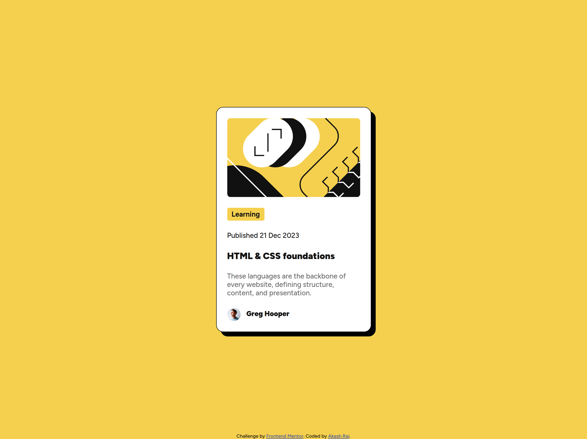

# Frontend Mentor - Blog preview card solution

This is a solution to the [Blog preview card challenge on Frontend Mentor](https://www.frontendmentor.io/challenges/blog-preview-card-ckPaj01IcS). Frontend Mentor challenges help you improve your coding skills by building realistic projects. 

## Table of contents

- [Overview](#overview)
  - [The challenge](#the-challenge)
  - [Screenshot](#screenshot)
  - [Links](#links)
- [My process](#my-process)
  - [Built with](#built-with)
  - [Useful resources](#useful-resources)
- [Author](#author)

## Overview 

### The Challenge

Users should be able to:

- See hover and focus states for all interactive elements on the page

### Screenshots

### Links

- [Solution URL](https://your-solution-url.com)
- [Live Site URL](https://akasr.github.io/fm/blog-preview-card-main/index.html)

## My process

### Built with

- Semantic HTML5 markup
- CSS variables
- Flexbox
- Mobile-first workflow

### Useful resources

- [CSS Box Shadow](https://developer.mozilla.org/en-US/docs/Web/CSS/box-shadow) - This helped me to understand how to use box-shadow property in CSS.

## Author
 - Frontend Mentor - [@akasr](https://www.frontendmentor.io/profile/akasr)
 - Website - [Akash Raj](https://akasr.github.io)