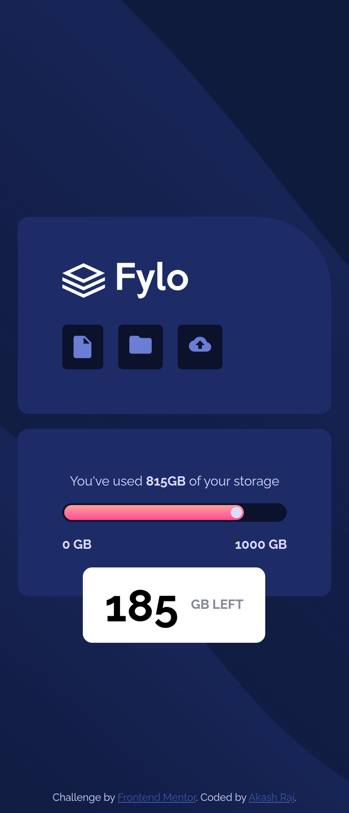
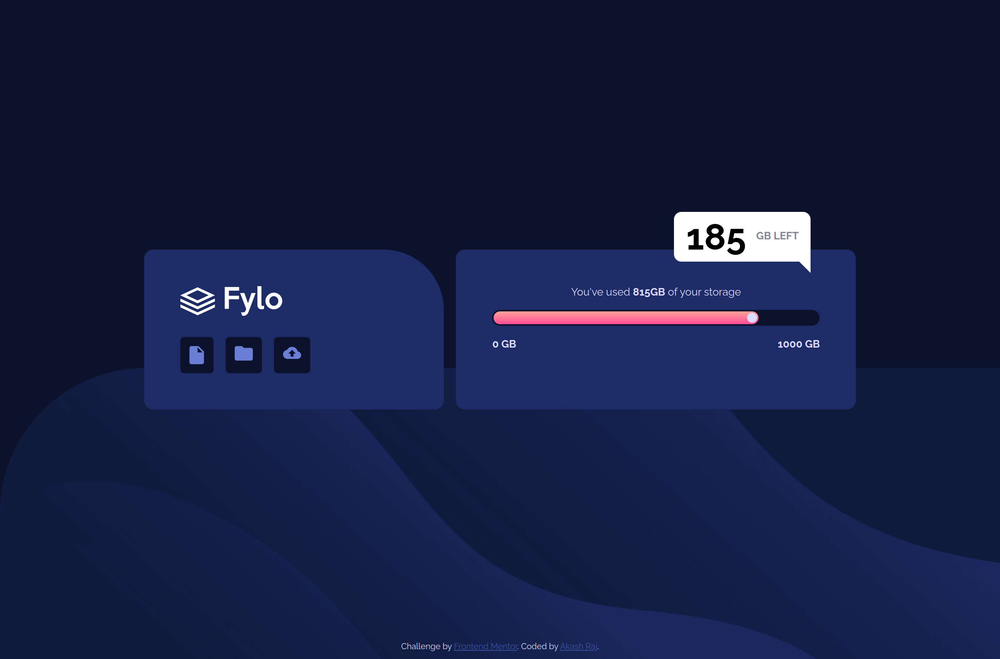

# Frontend Mentor - Fylo data storage component solution

This is a solution to the [Fylo data storage component challenge on Frontend Mentor](https://www.frontendmentor.io/challenges/fylo-data-storage-component-1dZPRbV5n). Frontend Mentor challenges help you improve your coding skills by building realistic projects. 

## Table of contents

- [Overview](#overview)
  - [The challenge](#the-challenge)
  - [Screenshot](#screenshot)
  - [Links](#links)
- [My process](#my-process)
  - [Built with](#built-with)
- [Author](#author)

## Overview

### The challenge

Users should be able to:

- View the optimal layout for the site depending on their device's screen size

### Screenshot

### Links

- [Solution URL](https://github.com/akasr/fm/tree/main/fylo-data-storage)
- [Live Site URL](https://akasr.github.io/fm/fylo-data-storage/)

## My process

### Built with

- Semantic HTML5 markup
- CSS variables
- Flexbox
- Mobile-first workflow

## Author

- Frontend Mentor - [@akasr](https://www.frontendmentor.io/profile/akasr)
- Website - [Akash Raj](https://akasr.github.io)