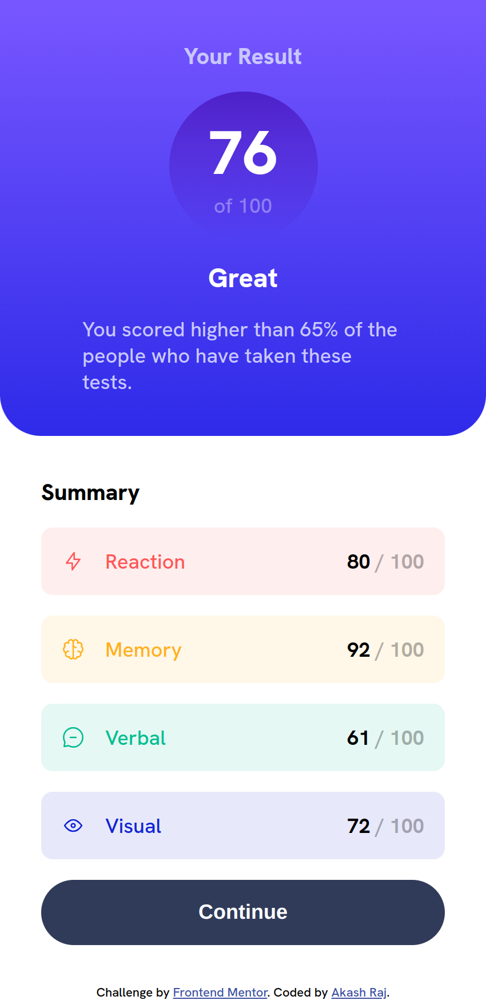
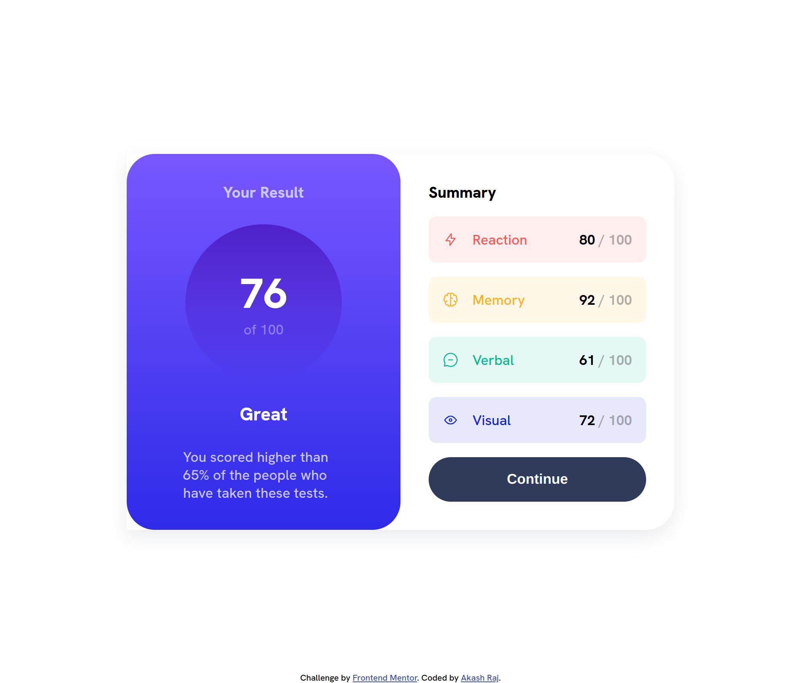

# Frontend Mentor - Results summary component solution

This is a solution to the [Results summary component challenge on Frontend Mentor](https://www.frontendmentor.io/challenges/results-summary-component-CE_K6s0maV). Frontend Mentor challenges help you improve your coding skills by building realistic projects. 

## Table of contents

- [Overview](#overview)
  - [The challenge](#the-challenge)
  - [Screenshot](#screenshot)
  - [Links](#links)
- [My process](#my-process)
  - [Built with](#built-with)
  - [What I learned](#what-i-learned)
  - [Useful resources](#useful-resources)
- [Author](#author)

## Overview

### The challenge

Users should be able to:

- View the optimal layout for the interface depending on their device's screen size
- See hover and focus states for all interactive elements on the page

### Screenshot

### Links

- [Solution URL](https://github.com/akasr/fm/tree/main/results-summary-component)
- [Live Site URL](https://akasr.github.io/fm/results-summary-component/)

## My process

### Built with

- Semantic HTML5 markup
- CSS variables
- CSS Gradient
- Flexbox
- Mobile-first workflow

### What I learned

I learnt that when an element is overlapped by some other element, the `:hover` and `:focus` states are not triggered. This is because the element is not directly under the cursor. This can be fixed by using `pointer-events: none;` on the overlapping element.

### Useful resources

- [MDN Web Docs](https://developer.mozilla.org/en-US/) - This helped me understand the `pointer-events` property.
- [CSS Scan](https://getcssscan.com/css-box-shadow-examples) - This is an amazing tool to generate box-shadow and gradient code.

## Author

- Frontend Mentor - [@akasr](https://www.frontendmentor.io/profile/akasr)
- Website - [Akash Raj](https://akasr.github.io)