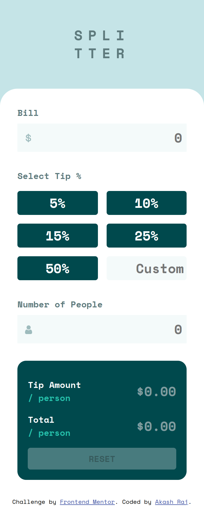

# Frontend Mentor - Tip calculator app solution

This is a solution to the [Tip calculator app challenge on Frontend Mentor](https://www.frontendmentor.io/challenges/tip-calculator-app-ugJNGbJUX). Frontend Mentor challenges help you improve your coding skills by building realistic projects.

## Table of contents

- [Overview](#overview)
    - [The challenge](#the-challenge)
    - [Screenshot](#screenshot)
    - [Links](#links)
- [My process](#my-process)
    - [Built with](#built-with)
    - [What I learned](#what-i-learned)
    - [Useful resources](#useful-resources)
- [Author](#author)

## Overview

### The challenge

Users should be able to:

- View the optimal layout for the app depending on their device's screen size
- See hover states for all interactive elements on the page
- Calculate the correct tip and total cost of the bill per person

### Screenshot

### Links

- [Solution URL](https://github.com/akasr/fm/tree/main/javascript/tip-calculator-app)
- [Live Site URL](https://akasr.github.io/fm/javascript/tip-calculator-app/)

## My process

### Built with

- Semantic HTML5 markup
- CSS custom properties
- Flexbox
- CSS Grid
- Mobile-first workflow

### What I learned

- onchange event in input field does not run the callback function until the input field loses focus. To run the callback function on every change, use oninput event.
- `try - catch - finally` block in JavaScript.
- `toFixed()` method in JavaScript.
- select `input::placeholder` in CSS.

### Useful resources

- https://www.w3schools.com/js/js_errors.asp
- https://stackoverflow.com/questions/7105997/javascript-change-event-on-input-element-fires-on-only-losing-focus
- https://stackoverflow.com/questions/33924655/position-last-flex-item-at-the-end-of-container

## Author

- Frontend Mentor - [@akasr](https://www.frontendmentor.io/profile/akasr)
- Website - [Akash Raj](https://akasr.github.io)
